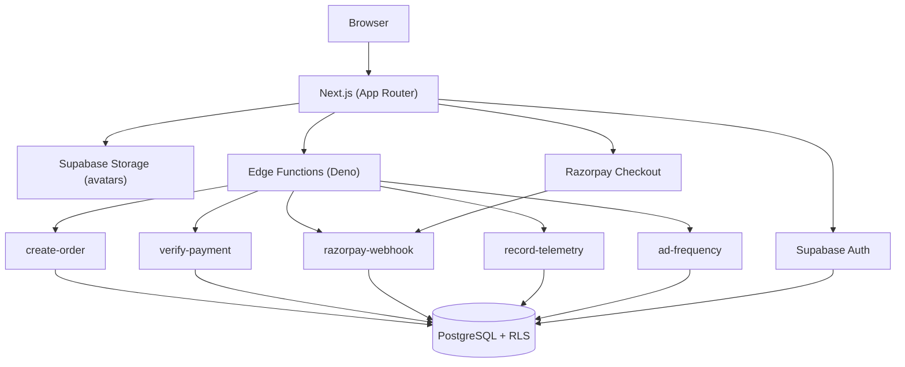
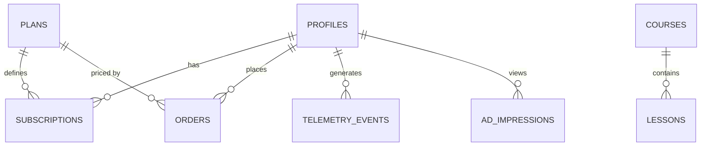

<p align="center">
  <h1 align="center">SkillVault</h1>

  <p align="center">
    <strong>A Production Backend Engineering Case Study</strong>
  </p>

  <p align="center">
    <a href="https://skillvault.siraddeen.in">🌐 Live Demo</a>
  </p>

  <p align="center">
    
    
    
    
    
    
  </p>
</p>


**A backend-engineering case study** — a course/roadmap platform built to demonstrate production-style patterns: PostgreSQL schema design with Row Level Security, Supabase Edge Functions, Razorpay payment integration, and query-level analytics.

🔗 **Live:** [skillvault.siraddeen.in](https://skillvault.siraddeen.in)

The primary focus of this project is backend architecture and infrastructure. The frontend serves as a lightweight interface to demonstrate authentication, authorization, subscriptions, analytics, and storage workflows.

---

## Job requirements covered

This project was built to mirror a specific backend-engineer role. Here's how it maps:

| Requirement | Status |
|---|---|
| PostgreSQL schema design | ✅ |
| Row Level Security (tiered access) | ✅ |
| TypeScript | ✅ |
| Supabase Edge Functions (Deno) | ✅ |
| Razorpay webhooks | ✅ |
| Telemetry intake | ✅ |
| Ad frequency capping | ✅ |
| Authentication | ✅ |
| Role-based access (admin) | ✅ |
| Analytics (server-computed) | ✅ |
| Object storage | ✅ (Supabase Storage) |
| Migrations owned end-to-end | ✅ |
| API contracts (`docs/api-contract.md`) | ✅ |
| Query plan / denormalization notes (`docs/query-plans.md`) | ✅ |
| GCP (Cloud Run, Cloud Storage, BigQuery) | ⚠️ Partial — see note below |

## Architecture



## Database schema (simplified)



`plans` and `courses` metadata are publicly readable (like a pricing page); `lessons`, `subscriptions`, and `telemetry_events` are the actual tier-gated / privacy-sensitive tables, enforced via RLS and `SECURITY DEFINER` functions rather than in application code.

## Feature walkthrough

- **Login** — Supabase Auth (email/password)
- **Dashboard** — session overview, current tier, quick links
- **Courses** — every course is visible to every visitor; courses above the user's tier show a blurred thumbnail + upgrade prompt (upsell, not a hard wall). The actual lesson content is the real gate, enforced via RLS — not the UI.
- **Course detail** — lessons are tier-gated server-side; free-tier content is visible to anonymous users too. Viewing a course fires a `lesson_view` telemetry event.
- **Subscription** — Free / Basic / Premium plans, live Razorpay Checkout for upgrades (test mode, no real charges)
- **Analytics** — premium conversion rate, 14-day DAU trend, and top-5 courses by views — computed via three `SECURITY DEFINER` Postgres functions rather than querying raw event tables from the client
- **Settings** — avatar upload via Supabase Storage with per-user folder RLS
- **Admin** — course CRUD and a full user list (tier, subscription status), gated by an `is_admin` flag and RLS-protected admin-only policies

## Architecture notes worth reading

**Tiered access is enforced in the database, not the frontend.** A `current_user_tier()` SECURITY DEFINER function joins `subscriptions` + `plans`; RLS policies on `courses`/`lessons` reference it directly, so even a compromised or bypassed frontend can't see content above a user's paid tier.

**Payments have two independent confirmation paths.** `verify-payment` is the fast client-side path after Razorpay Checkout succeeds; the `razorpay-webhook` function is the *authoritative* source of truth — it verifies the raw-body HMAC signature independently and idempotently marks orders paid, so a dropped client connection can never leave a paid order stuck as pending.

**Analytics are pre-aggregated server-side.** `telemetry_events` and `subscriptions` have no client-facing SELECT policies at all — the three analytics RPCs run as `SECURITY DEFINER` and return only the aggregated numbers, so raw event data is never exposed to the browser.

**Performance: request-deduped auth.** Every dashboard route independently needed the current user + tier, which was causing redundant sequential Supabase round trips on each navigation. Fixed by wrapping the auth/tier/profile lookups in React's `cache()` so a single navigation only fetches each of them once, and parallelizing the independent queries that remained.

**About GCP.** Original scope included Cloud Run, Cloud Storage, and BigQuery to match the target job posting's full stack. Avatar storage was pivoted from Google Cloud Storage to **Supabase Storage** after hitting Google Cloud's billing-account requirement mid-build; the BigQuery export was not completed. The `gcp/` folder is kept in the repo for reference rather than deleted — it reflects a real mid-project infrastructure decision, not abandoned work.


## Screenshots

### Landing & Dashboard

<p align="center">
  
  
</p>

### Subscription, Analytics & Admin

<p align="center">
  
  
  
</p>


## Future improvements

- BigQuery export for analytics (original scope)
- Cloud Run deployment for a background-job worker
- Redis caching for hot read paths (plans, course catalog)
- Event streaming for telemetry instead of direct-write RPCs
- Observability dashboards (structured logging + tracing across Edge Functions)

## Local setup

```bash
git clone <this-repo>
cd skillvault/apps/web
npm install
```

Create `.env.local` with:
```
NEXT_PUBLIC_SUPABASE_URL=
NEXT_PUBLIC_SUPABASE_ANON_KEY=
NEXT_PUBLIC_SITE_URL=

RAZORPAY_KEY_ID=
RAZORPAY_KEY_SECRET=
```

Apply the database schema and deploy the edge functions from the `supabase/` directory:
```bash
supabase db push
supabase functions deploy create-order
supabase functions deploy verify-payment
supabase functions deploy razorpay-webhook
supabase functions deploy record-telemetry
supabase functions deploy ad-frequency
```

Then run the app:
```bash
npm run dev
```

## Edge Functions

| Function | Responsibility |
|----------|----------------|
| create-order | Creates Razorpay orders |
| verify-payment | Client-side payment verification |
| razorpay-webhook | Authoritative payment confirmation |
| record-telemetry | Stores analytics events |
| ad-frequency | Computes advertisement frequency |

## Repo structure

```
skillvault/
├── apps/
│   └── web/
│       ├── src/
│       │   ├── app/          # Next.js App Router pages
│       │   ├── components/
│       │   ├── lib/          # Supabase client/server helpers
│       │   └── actions/
│       └── public/
│
├── supabase/
│   ├── migrations/           # schema, RLS policies, RPCs
│   ├── functions/
│   │   ├── create-order/
│   │   ├── verify-payment/
│   │   ├── razorpay-webhook/
│   │   ├── record-telemetry/
│   │   └── ad-frequency/
│   └── seed.sql
│
├── docs/                     # architecture.md, api-contract.md, query-plans.md
│
└── gcp/bigquery-export/      # original GCP scope — see note above
```

## License

This project is licensed under the MIT License. See the [LICENSE](LICENSE) file for details.

## 👨‍💻 Author

**Siraddeen**

Backend Engineer • Full-Stack Developer • AI Engineer

🌐 **Portfolio:** https://portfolio.siraddeen.in

💼 **LinkedIn:** https://www.linkedin.com/in/siraddeen/

🐙 **GitHub:** https://github.com/Siraddeen

